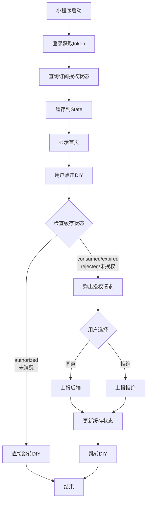
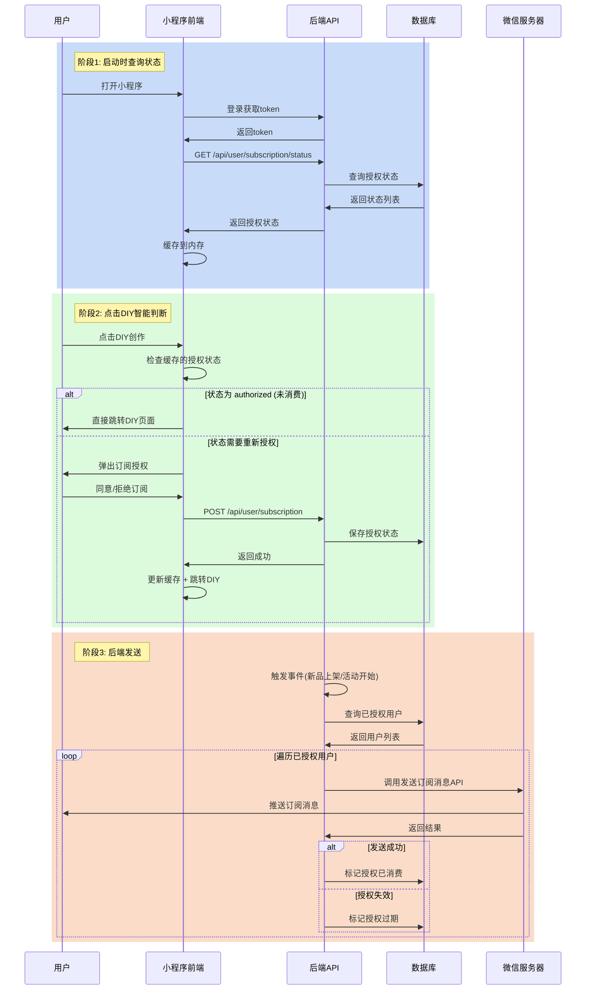

# DIY创作订阅提醒功能设计文档

> **文档版本**: v2.0  
> **创建日期**: 2025-12-24  
> **更新日期**: 2025-12-24  
> **功能概述**: 小程序启动时查询订阅授权状态并缓存，用户点击"DIY创作"时根据状态智能判断是否需要请求授权，确保一次性订阅消费后能够重新获取授权

---

## 目录

- [1. 功能背景](#1-功能背景)
- [2. 技术架构](#2-技术架构)
- [3. 前端实现](#3-前端实现)
- [4. 后端实现](#4-后端实现)
- [5. 订阅消息机制说明](#5-订阅消息机制说明)
- [6. 实现清单](#6-实现清单)

---

## 1. 功能背景

### 1.1 业务需求

用户在点击"DIY创作"按钮时，需要获取两个订阅消息权限：
- **新品开售提醒**: 模板ID `MKT7vjzg2JVJ2qfuCxwd6n1vD432k9-ICyumG_R8LlU`
- **活动开始提醒**: 模板ID `A3naddildeEgkTDh_T8nqD5etiklpcwHrTpCLBc6HDs`

### 1.2 交互规则

- ✅ 小程序启动时查询授权状态并缓存到内存
- ✅ 点击DIY时根据缓存的授权状态智能判断：
  - 状态为 `authorized`（已授权未消费）→ 直接跳转，不弹窗
  - 状态为 `consumed/expired/rejected`（已消费/已过期/已拒绝）→ 弹出授权请求
  - **查询失败或无状态** → 视为已授权，直接跳转，不弹窗 ⚠️
- ✅ **无论授权结果**如何，都允许用户继续跳转
- ✅ 授权结果实时上报到后端，保持状态同步

### 1.3 容错策略

**查询授权状态失败时的处理**：
- 网络异常、后端服务异常等导致查询失败
- 采用保守策略：**默认不打扰用户**
- 视为已授权，允许用户正常使用DIY功能
- 避免因后端问题影响用户体验

### 1.4 解决的核心问题

**一次性订阅的局限性**：
- 用户授权一次只能发送一次消息
- 消息发送后授权失效
- 如果前端不重新请求，用户将永远无法收到后续通知

**我们的解决方案**：
- 小程序启动时查询后端的真实授权状态
- 根据状态动态决定是否需要重新授权
- 用户无感知，体验流畅

---

## 2. 技术架构

### 2.1 完整授权流程



### 2.2 前后端协作时序图



---

## 3. 前端实现

### 3.1 添加订阅消息模板 ID 配置

**文件**: `src/config/index.ts`

在文件末尾添加：

```typescript
// 订阅消息模板 ID
export const SUBSCRIPTION_NEW_PRODUCT_TEMPLATE_ID = "MKT7vjzg2JVJ2qfuCxwd6n1vD432k9-ICyumG_R8LlU"; // 新品开售提醒
export const SUBSCRIPTION_ACTIVITY_TEMPLATE_ID = "A3naddildeEgkTDh_T8nqD5etiklpcwHrTpCLBc6HDs"; // 活动开始提醒
```

### 3.2 添加 API 接口

**文件**: `src/utils/api.ts`

在 `userApi` 对象中添加两个新方法：

```typescript
// 查询用户订阅授权状态
getSubscriptionStatus: (data: {
  templateIds: string[];
  showLoading?: boolean;
  showError?: boolean;
}) => request({
  url: '/user/subscription/status',
  method: 'GET',
  data: { template_ids: data.templateIds.join(',') },
  showLoading: data.showLoading,
  showError: data.showError,
}),

// 上报用户订阅授权结果
reportSubscription: (data: {
  subscriptions: Record<string, string>;
  showLoading?: boolean;
  showError?: boolean;
}) => request({
  url: '/user/subscription',
  method: 'POST',
  data: data.subscriptions,
  showLoading: data.showLoading,
  showError: data.showError,
}),
```

### 3.3 在小程序启动时查询授权状态

**文件**: `src/pages/home/index.tsx`

#### 添加状态管理

在组件顶部添加状态：

```typescript
const [subscriptionStatus, setSubscriptionStatus] = useState<Record<string, string>>({});
```

#### 在 `useLoad` 中查询授权状态

修改现有的 `useLoad` 钩子，在登录成功后查询授权状态：

```typescript
useLoad((options) => {
  const code = options.code;
  
  const initializeApp = async () => {
    try {
      // 1. 清除旧的认证并重新登录
      AuthManager.clearAuth();
      await AuthManager.login(code);
      console.log("✅ 登录成功");

      if (code) {
        Taro.showToast({
          title: `通过分享码${code}进入！`,
          icon: "none",
          duration: 2000,
        });
      }

      // 2. 获取用户信息和分享码
      const res = await userApi.getUserInfo({ 
        showLoading: false, 
        showError: false 
      });
      const user = res.data as any;
      if (user && user.is_promo_enable) {
        console.log("✅ 获取到分享码:", user.promo_code);
        setInvitationCode(user.promo_code);
      }

      // 3. ✨ 查询订阅授权状态
      try {
        const statusRes = await userApi.getSubscriptionStatus({
          templateIds: [
            SUBSCRIPTION_NEW_PRODUCT_TEMPLATE_ID,
            SUBSCRIPTION_ACTIVITY_TEMPLATE_ID
          ],
          showLoading: false,
          showError: false
        });
        
        // 将状态转换为 Map 便于查询
        const statusMap: Record<string, string> = {};
        statusRes.data.forEach((item: any) => {
          statusMap[item.template_id] = item.status;
        });
        
  setSubscriptionStatus(statusMap);
  console.log("✅ 订阅状态已加载:", statusMap);
} catch (error) {
  console.error("❌ 查询订阅状态失败:", error);
  // 查询失败保持空对象，后续不会请求授权（容错策略）
  setSubscriptionStatus({});
}

      // 4. 初始化完成后显示分享菜单
      Taro.showShareMenu({
        withShareTicket: true,
        showShareItems: ["shareAppMessage", "shareTimeline"],
      });
    } catch (error) {
      console.error("❌ 初始化失败:", error);
      setInvitationCode("");
      // 即使失败也显示分享菜单
      Taro.showShareMenu({
        withShareTicket: true,
        showShareItems: ["shareAppMessage", "shareTimeline"],
      });
    }
  };

  initializeApp();
});
```

### 3.4 修改 DIY 创作按钮点击逻辑

**文件**: `src/pages/home/index.tsx`

#### 添加判断辅助函数

在组件中添加辅助函数，用于判断是否需要重新授权：

```typescript
// 判断是否需要请求订阅授权
const needSubscriptionAuthorization = () => {
  // 如果状态为空对象，说明查询失败，默认不请求授权（容错）
  if (Object.keys(subscriptionStatus).length === 0) {
    return false;
  }
  
  const checkStatus = (templateId: string) => {
    const status = subscriptionStatus[templateId];
    // 只有明确的需要重新授权状态才返回 true
    return status === 'consumed' || 
           status === 'expired' || 
           status === 'rejected' ||
           status === 'not_authorized';
  };
  
  return checkStatus(SUBSCRIPTION_NEW_PRODUCT_TEMPLATE_ID) ||
         checkStatus(SUBSCRIPTION_ACTIVITY_TEMPLATE_ID);
};
```

#### 当前实现（第 278-285 行）

```typescript
onClick={() => {
  Taro.reportEvent("homepage_event", { home_diy_click: 1 });
  Taro.redirectTo({
    url: pageUrls.customDesign + "?from=home",
  });
}}
```

#### 改造后的实现

```typescript
onClick={async () => {
  Taro.reportEvent("homepage_event", { home_diy_click: 1 });
  
  // 根据缓存的授权状态判断是否需要请求授权
  if (needSubscriptionAuthorization()) {
    try {
      // 1. 请求订阅授权
      const result = await ensureSubscribe({
        templateIds: [
          SUBSCRIPTION_NEW_PRODUCT_TEMPLATE_ID,
          SUBSCRIPTION_ACTIVITY_TEMPLATE_ID
        ],
        includeAlwaysAccept: true
      });
      
      // 2. 上报授权结果到后端
      if (result.requested && result.result) {
        await userApi.reportSubscription({
          subscriptions: result.result,
          showLoading: false,
          showError: false
        });
        
        // 3. 更新本地缓存的状态
        const newStatus = { ...subscriptionStatus };
        Object.keys(result.result).forEach(templateId => {
          if (result.result[templateId] === 'accept') {
            newStatus[templateId] = 'authorized';
          } else if (result.result[templateId] === 'reject') {
            newStatus[templateId] = 'rejected';
          }
        });
        setSubscriptionStatus(newStatus);
        console.log("✅ 订阅状态已更新:", newStatus);
      }
    } catch (error) {
      console.error('订阅流程失败:', error);
    }
  }
  
  // 跳转（无论授权结果）
  Taro.redirectTo({
    url: pageUrls.customDesign + "?from=home",
  });
}}
```

#### 添加导入语句（文件顶部）

```typescript
import { ensureSubscribe } from '@/utils/messageUtils';
import { SUBSCRIPTION_NEW_PRODUCT_TEMPLATE_ID, SUBSCRIPTION_ACTIVITY_TEMPLATE_ID } from '@/config';
```

### 3.5 关键技术点

| 技术点 | 说明 |
|--------|------|
| **状态缓存** | 使用 React State 缓存授权状态（内存级别） |
| **启动时查询** | 在 `useLoad` 钩子中查询，用户无感知 |
| **智能判断** | 根据缓存状态动态决定是否弹窗 |
| **容错策略** | 查询失败时默认不打扰用户 ⚠️ |
| **订阅工具** | 使用项目现有的 `ensureSubscribe()` 函数 |
| **状态同步** | 授权后立即更新缓存和后端 |
| **用户体验** | 无论授权结果都允许跳转 |

### 3.6 依赖的现有工具

项目中已实现的 `ensureSubscribe()` 函数（位于 `src/utils/messageUtils.ts`）：
- 自动处理用户的固定选择（"总是保持以上，不再询问"）
- 智能判断哪些模板需要弹窗请求
- 返回标准化的授权结果

### 3.7 为什么不使用本地持久化存储？

**之前的问题**：
- 使用 `Taro.setStorageSync` 存储简单的布尔标记
- 一旦标记为"已请求"，永远不会再请求
- 即使授权被消费，也无法重新获取

**现在的方案**：
- 使用内存级别的 State 缓存
- 每次启动都从后端获取最新状态
- 确保状态与后端数据库保持同步

### 3.8 错误处理和容错机制

#### 查询授权状态失败

**场景**：
- 网络异常
- 后端服务异常
- 接口超时

**处理策略**：
```typescript
try {
  // 查询授权状态
  const statusRes = await userApi.getSubscriptionStatus({...});
  setSubscriptionStatus(statusMap);
} catch (error) {
  // 失败时设置为空对象
  setSubscriptionStatus({});
  console.error("查询授权状态失败:", error);
}
```

**结果**：
- `subscriptionStatus` 为空对象 `{}`
- `needSubscriptionAuthorization()` 返回 `false`
- 用户点击DIY时**不会弹出授权请求**
- 保障用户正常使用功能

#### 判断逻辑

```typescript
const needSubscriptionAuthorization = () => {
  // 🔴 关键：空对象表示查询失败，默认不请求授权
  if (Object.keys(subscriptionStatus).length === 0) {
    return false;
  }
  
  // ... 其他判断逻辑
};
```

**设计理念**：
- ✅ **用户体验优先**：宁可少打扰，也不影响功能
- ✅ **降级策略**：后端异常时前端仍可正常使用
- ⚠️ **权衡**：可能错过部分授权机会，但保障了核心功能

---

## 4. 后端实现

### 4.1 数据库设计

创建用户订阅授权表：

```sql
CREATE TABLE user_subscriptions (
    id BIGINT PRIMARY KEY AUTO_INCREMENT,
    user_id BIGINT NOT NULL COMMENT '用户ID',
    openid VARCHAR(64) NOT NULL COMMENT '微信openid',
    template_id VARCHAR(100) NOT NULL COMMENT '模板ID',
    
    -- 授权状态
    status ENUM('authorized', 'consumed', 'expired', 'rejected') DEFAULT 'authorized'
        COMMENT 'authorized:已授权 consumed:已消费 expired:已过期 rejected:用户拒绝',
    
    -- 授权类型
    auth_type ENUM('once', 'always') DEFAULT 'once'
        COMMENT 'once:一次性授权 always:长期授权',
    
    -- 时间记录
    authorized_at DATETIME COMMENT '授权时间',
    consumed_at DATETIME COMMENT '消费时间',
    
    created_at DATETIME DEFAULT CURRENT_TIMESTAMP,
    updated_at DATETIME DEFAULT CURRENT_TIMESTAMP ON UPDATE CURRENT_TIMESTAMP,
    
    -- 索引
    UNIQUE KEY uk_user_template (user_id, template_id),
    INDEX idx_openid (openid),
    INDEX idx_status (status),
    INDEX idx_template (template_id)
) COMMENT='用户订阅消息授权表';
```

#### 字段说明

| 字段 | 说明 |
|------|------|
| `status` | `authorized`: 已授权<br>`consumed`: 已消费（一次性授权发送后）<br>`expired`: 已过期<br>`rejected`: 用户拒绝 |
| `auth_type` | `once`: 一次性授权<br>`always`: 长期授权 |

### 4.2 查询授权状态接口 ✨ 新增

#### 接口规范

- **路径**: `GET /api/user/subscription/status`
- **认证**: 需要 token
- **请求参数**: `template_ids` (逗号分隔的模板ID列表)

#### 请求示例

```http
GET /api/user/subscription/status?template_ids=MKT7vjzg2JVJ2qfuCxwd6n1vD432k9-ICyumG_R8LlU,A3naddildeEgkTDh_T8nqD5etiklpcwHrTpCLBc6HDs
Authorization: Bearer <token>
```

#### 响应示例

```json
{
  "code": 0,
  "message": "success",
  "data": [
    {
      "template_id": "MKT7vjzg2JVJ2qfuCxwd6n1vD432k9-ICyumG_R8LlU",
      "status": "consumed",
      "auth_type": "once",
      "authorized_at": "2025-12-20 10:00:00",
      "consumed_at": "2025-12-22 15:30:00"
    },
    {
      "template_id": "A3naddildeEgkTDh_T8nqD5etiklpcwHrTpCLBc6HDs",
      "status": "authorized",
      "auth_type": "once",
      "authorized_at": "2025-12-20 10:00:00",
      "consumed_at": null
    }
  ]
}
```

#### 状态说明

| 状态值 | 含义 | 前端处理 |
|--------|------|----------|
| `authorized` | 已授权，未消费 | ✅ 不需要重新授权 |
| `consumed` | 已消费（一次性授权已使用） | ❌ 需要重新授权 |
| `expired` | 已过期 | ❌ 需要重新授权 |
| `rejected` | 用户拒绝 | ❌ 需要重新授权 |
| `not_authorized` | 从未授权 | ❌ 需要重新授权 |
| （查询失败/无状态） | 网络异常或后端异常 | ✅ 不请求授权（容错） |

#### 后端实现示例

```python
@app.get("/api/user/subscription/status")
async def get_subscription_status(
    template_ids: str, 
    user_id: int = Depends(get_current_user)
):
    """查询用户的订阅授权状态"""
    
    template_id_list = template_ids.split(',')
    results = []
    
    for template_id in template_id_list:
        # 查询数据库最新记录
        record = db.query("""
            SELECT template_id, status, auth_type, authorized_at, consumed_at
            FROM user_subscriptions
            WHERE user_id = %s AND template_id = %s
            ORDER BY created_at DESC
            LIMIT 1
        """, [user_id, template_id])
        
        if record:
            results.append(record)
        else:
            # 未找到记录，表示从未授权
            results.append({
                "template_id": template_id,
                "status": "not_authorized",
                "auth_type": None,
                "authorized_at": None,
                "consumed_at": None
            })
    
    return {"code": 0, "message": "success", "data": results}
```

### 4.3 接收授权结果接口

#### 接口规范

- **路径**: `POST /api/user/subscription`
- **认证**: 需要 token
- **Content-Type**: `application/json`

#### 请求体示例

```json
{
  "MKT7vjzg2JVJ2qfuCxwd6n1vD432k9-ICyumG_R8LlU": "accept",
  "A3naddildeEgkTDh_T8nqD5etiklpcwHrTpCLBc6HDs": "reject"
}
```

#### 处理逻辑

1. 从 token 中提取 `user_id` 和 `openid`
2. 遍历订阅结果（`key` 为模板ID，`value` 为用户选择）
3. 根据用户选择保存到数据库：
   - `accept` → 保存为 `authorized` 状态
   - `reject` → 保存为 `rejected` 状态
   - `ban` → 保存为 `expired` 状态

#### 响应示例

```json
{
  "code": 0,
  "message": "success"
}
```

### 4.4 发送订阅消息

#### 触发时机

- 新品上架
- 活动开始

#### 发送流程

```python
async def send_new_product_notification(product_id: int):
    """新品上架时发送订阅消息"""
    
    template_id = "MKT7vjzg2JVJ2qfuCxwd6n1vD432k9-ICyumG_R8LlU"
    
    # 1. 查询已授权的用户
    authorized_users = db.query("""
        SELECT user_id, openid 
        FROM user_subscriptions 
        WHERE template_id = %s 
        AND status = 'authorized'
    """, [template_id])
    
    # 2. 获取新品信息
    product = get_product_info(product_id)
    
    # 3. 批量发送
    for user in authorized_users:
        result = await send_subscribe_message(
            openid=user['openid'],
            template_id=template_id,
            page=f"pages-product/product-detail/index?id={product_id}",
            data={
                "thing1": {"value": product['name'][:20]},
                "time2": {"value": product['launch_time']},
                "thing3": {"value": "点击查看详情"}
            }
        )
        
        # 4. 更新授权状态
        if result['errcode'] == 0:
            # 发送成功，标记为已消费
            update_status(user['user_id'], template_id, 'consumed')
        elif result['errcode'] == 43101:
            # 授权失效
            update_status(user['user_id'], template_id, 'expired')
```

#### 微信 API 调用

```http
POST https://api.weixin.qq.com/cgi-bin/message/subscribe/send?access_token=TOKEN

Content-Type: application/json

{
  "touser": "OPENID",
  "template_id": "MKT7vjzg2JVJ2qfuCxwd6n1vD432k9-ICyumG_R8LlU",
  "page": "pages-product/product-detail/index?id=123",
  "data": {
    "thing1": {"value": "新品名称"},
    "time2": {"value": "2025-12-24 10:00"},
    "thing3": {"value": "点击查看详情"}
  },
  "miniprogram_state": "formal"
}
```

#### 微信 API 响应

成功：
```json
{
  "errcode": 0,
  "errmsg": "ok"
}
```

失败：
```json
{
  "errcode": 43101,
  "errmsg": "user refuse to accept the msg hint"
}
```

#### 常见错误码

| 错误码 | 说明 | 处理方式 |
|--------|------|----------|
| 0 | 发送成功 | 标记为 `consumed` |
| 43101 | 用户拒绝或授权已失效 | 标记为 `expired` |
| 47003 | 模板参数不准确 | 检查参数格式 |
| 41030 | page 路径不正确 | 检查跳转路径 |

### 4.5 发送策略建议

#### ❌ 不推荐：向所有用户无差别发送

```python
# 错误做法
for user in all_users:
    send_message(user.openid, template_id)  # 会产生大量无效调用
```

#### ✅ 推荐：维护授权状态，智能过滤

```python
# 正确做法
authorized_users = get_authorized_users(template_id)  # 只查询已授权用户
for user in authorized_users:
    send_message(user.openid, template_id)
```

#### 批量发送优化

```python
# 分批发送 + 限流
async def batch_send_with_rate_limit(users: List[Dict], batch_size=100):
    for i in range(0, len(users), batch_size):
        batch = users[i:i+batch_size]
        
        # 并发发送当前批次
        tasks = [send_to_user(user) for user in batch]
        await asyncio.gather(*tasks)
        
        # 批次间延迟，避免触发微信限流
        if i + batch_size < len(users):
            await asyncio.sleep(1)
```

---

## 5. 订阅消息机制说明

### 5.1 授权机制

#### 一次性订阅（默认）

- 用户授权一次 = 可发送一次消息
- 后端发送消息后，授权自动失效
- 下次发送需要用户重新授权

#### 长期订阅

- 用户在授权弹窗中点击 **"总是保持以上，不再询问"**
- 授权永久有效（除非用户手动关闭）
- 后端可以反复发送消息

### 5.2 前端 vs 后端职责

| 角色 | 职责 | 能力限制 |
|------|------|----------|
| **前端** | 请求用户授权 | ❌ 不能发送订阅消息 |
| **后端** | 发送订阅消息 | ❌ 不能请求用户授权 |

### 5.3 微信的二次验证

即使后端维护了授权状态，**微信服务器仍会二次验证**：
- 用户未授权 → 返回错误码 43101
- 一次性授权已消费 → 返回错误码 43101
- 用户关闭了长期授权 → 返回错误码 43101

因此，建议：
1. **后端维护授权表** - 减少无效 API 调用
2. **处理微信错误码** - 根据返回结果更新授权状态

---

## 6. 实现清单

### 6.1 前端开发任务

- [ ] 在 `config/index.ts` 添加订阅消息模板 ID 常量
- [ ] 在 `utils/api.ts` 添加两个接口：
  - [ ] `getSubscriptionStatus` - 查询授权状态
  - [ ] `reportSubscription` - 上报授权结果
- [ ] 修改 `pages/home/index.tsx`：
  - [ ] 添加状态管理 `subscriptionStatus`
  - [ ] 在 `useLoad` 中查询授权状态并缓存
  - [ ] 添加判断辅助函数 `needSubscriptionAuthorization`
  - [ ] 修改 DIY 按钮点击逻辑（根据缓存状态判断）
  - [ ] 添加必要的导入语句
- [ ] 测试不同场景：
  - [ ] 首次使用（从未授权）
  - [ ] 授权后未消费（直接跳转）
  - [ ] 授权已消费（重新请求）
  - [ ] 用户拒绝授权（下次仍会请求）

### 6.2 后端开发任务

- [ ] 创建数据库表 `user_subscriptions`
- [ ] 实现接口 `GET /api/user/subscription/status` ✨ 新增
  - [ ] 查询用户的授权状态
  - [ ] 处理未授权的情况
- [ ] 实现接口 `POST /api/user/subscription`
  - [ ] 接收并保存授权结果
  - [ ] 更新现有记录或插入新记录
- [ ] 实现发送订阅消息的功能（新品上架时）
  - [ ] 查询 `status='authorized'` 的用户
  - [ ] 调用微信 API 发送
  - [ ] 根据返回结果更新状态为 `consumed` 或 `expired`
- [ ] 实现发送订阅消息的功能（活动开始时）
- [ ] 处理微信 API 错误码，更新授权状态

### 6.3 测试验证

#### 前端测试

- [ ] 首次点击 DIY 创作，验证弹出授权弹窗
- [ ] 同意授权，验证本地标记已保存
- [ ] 再次点击，验证不再弹窗
- [ ] 验证授权结果已上报到后端

#### 后端测试

- [ ] 验证授权数据已正确保存到数据库
- [ ] 模拟新品上架，验证消息发送成功
- [ ] 验证一次性授权发送后状态更新为 `consumed`
- [ ] 验证长期授权可以反复发送

---

## 7. 预期效果

### 7.1 前端效果

1. ✅ 小程序启动时自动查询授权状态，用户无感知
2. ✅ 授权未消费时，点击DIY直接跳转，体验流畅
3. ✅ 授权已消费时，智能弹出重新授权，确保能收到后续通知
4. ✅ 授权状态实时同步到后端
5. ✅ 无论授权结果如何，都能正常跳转到 DIY 页面

### 7.2 解决的核心问题

**一次性订阅的痛点**：
- ❌ 旧方案：用户授权一次后，永远不会再请求授权
- ❌ 结果：消息发送一次后，用户再也收不到通知

**新方案的优势**：
- ✅ 启动时查询真实状态，与后端数据库同步
- ✅ 授权消费后自动重新请求
- ✅ 用户无感知，体验流畅（启动时查询）

### 7.3 后端效果

1. ✅ 维护用户订阅授权状态
2. ✅ 在新品上架或活动开始时，向已授权用户发送订阅消息
3. ✅ 自动处理授权消费和过期状态
4. ✅ 减少无效 API 调用，提升系统效率

---

## 8. 参考资料

- [微信小程序订阅消息文档](https://developers.weixin.qq.com/miniprogram/dev/framework/open-ability/subscribe-message.html)
- [Taro 本地存储 API](https://taro-docs.jd.com/docs/apis/storage/setStorageSync)
- 项目内部工具：`src/utils/messageUtils.ts`

---

**文档维护**: 如有问题或需要更新，请联系前端团队

